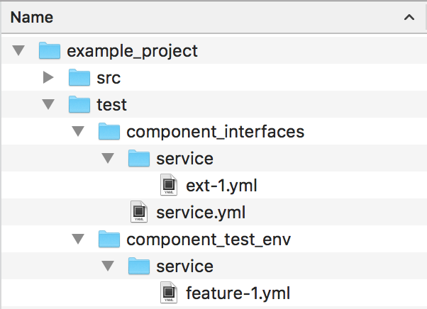

.. intercom_test documentation master file, created by
   sphinx-quickstart on Wed Oct 24 11:55:15 2018.
   You can adapt this file completely to your liking, but it should at least
   contain the root `toctree` directive.

Welcome to intercom_test's documentation!
=========================================

.. toctree::
   :maxdepth: 2
   :caption: Contents:
   
   modules

Using This Package
==================

:py:mod:`intercom_test` provides :py:class:`~intercom_test.framework.InterfaceCaseProvider`
to iterate over test cases defined in YAML files.  With the additional use of a
*case_augmenter* -- either an :py:class:`~intercom_test.framework.HTTPCaseAugmenter`,
a :py:class:`~intercom_test.framework.RPCCaseAugmenter`, or your own class
derived from :py:class:`~intercom_test.framework.CaseAugmenter` -- the
:py:class:`~intercom_test.framework.InterfaceCaseProvider` can add more data
from a different directory to any test case; this supports decoupling a *service
provider's* implementation details necessary to passing the given test case from
the request and response information needed by both the *consumer* and the
*provider*.

What It Looks Like In Practice
==============================

   
   Example directory tree for using :py:mod:`intercom_test`

The :py:mod:`intercom_test` package does not make many requirements of the
directory structure for the project using it, but here is one example of how a
project could be structured to use :py:mod:`intercom_test`.

This package has no direct concern with the ``src`` folder.  Within the ``test``
folder, this example project has split the data managed by :py:mod:`intercom_test`
into ``component_interfaces`` and ``component_test_env``.  The structure,
relationship, and usage of these two folders are described below.

In this example, the ``component_interfaces`` contain both a *main* test case
file, (``$PROJECT/test/component_interfaces/service.yml``) and also an
extension file (``$PROJECT/test/component_interfaces/service/ext-1.yml``),
which will be combined into a single set of test cases by :py:mod:`intercom_test`.
Any additional ``.yml`` files added to the ``$PROJECT/test/component_interfaces/service``
folder will also be read as additional test cases for *service*.  Typically,
the ``component_interfaces`` folder would be shared with the projects intending
to consume this service via some version control mechanism like a Git submodule
or a Subversion *externals definition*.  When constructing an
:py:class:`~intercom_test.framework.InterfaceCaseProvider` with the
``example_project`` directory as the current directory, the first argument
should be ``"test/component_interfaces"`` and the second argument ``"service"``
(indicating both the ``service.yml`` file *and* all files matching
``service/*.yml``).

Additionally, the ``component_test_env`` subfolder contains information
necessary for testing the service-provider, but which doesn't affect the
component interface -- database fixtures, data for mocking external services,
etc.  Within this folder, the *augmentation* data for the "service" is the set
of YAML (``.yml``) files located in the ``service`` folder; it is important to
note that the augmentation data will come from *all* files within the given
folder, so having a separate folder for each interface is probably wise.  The
path to pass when constructing one of the standard
:py:class:`~intercom_test.framework.CaseAugmenter` subclasses would therefore be
``"test/component_test_env/service"``.  Since this information is only important
for testing the provider and is tightly coupled to the provider implementation,
the entire ``component_test_env`` folder should probably be a part of the
service provider's source code repository and not shared with service consumers.
This example only contains one such file, named ``feature-1.yml``, but as many
augmentation files as desired can be created, though there is a restriction
on augmenting a single test case in multiple separate files.

So, assuming this project represents some kind of HTTP API, the most logical
way to create the :py:class:`~intercom_test.framework.InterfaceCaseProvider`
for this directory structure is::

    from intercom_test import InterfaceCaseProvider, HTTPCaseAugmenter
    
    ...
    
    def get_interface_case_provider():
        return InterfaceCaseProvider(
            "test/component_interfaces", "service",
            case_augmenter=HTTPCaseAugmenter("test/component_test_env/service")
        )
    
    ...

Indices and tables
==================

* :ref:`genindex`
* :ref:`modindex`
* :ref:`search`
